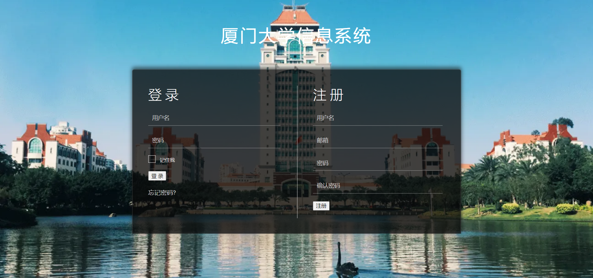

# readme

# 运行方法

数据库中导入crm.sql文件

在项目根目录下运行：

```python
python manage.py runserver 0.0.0.0:8000
```

在浏览器访问路径[http://127.0.0.1:8000/login/](http://127.0.0.1:8000/login/)



# 功能说明

本系统作为学生的一站式全生命周期管理系统，使用者在身份上具有多样性，所以接下来将从不同身份的用户的角度进行系统功能的介绍。此外，为了更好地对本系统的功能进行展示，我们录入了不同身份类型的用户账号作为示例，具体信息如附录所示。

## 1. 考生

考生类型用户指有意愿报考厦门大学，准备接受厦门大学自主招生考核的学生。对于考生而言，本系统需要提供的功能是注册、报考和相关信息查询，具体功能如下：

1)注册功能及报考功能

这一部分功能在“自主招生模块”-“个人信息管理”界面下实现。考生可以在这一界面完善或修改个人信息并填报志愿。

2)信息查询功能

这一部分功能在“自主招生模块”-“考试信息查询”界面下实现。考生可以在这一界面查询自己的考试科目、时间、地点、完成情况和成绩。

## 2. 学生

学生是现阶段在校的正式学生。对学生而言，本系统提供的功能主要包括个人信息的查询和修改、生活信息和学习信息的查询。

- 个人信息查询

这一部分的功能在“学生生活信息”-“个人信息查询”界面下实现。学生可以在这一界面下查询自己的学号、专业、班级和学生类型等基础个人信息

- 个人信息修改

这一部分的功能在“学生生活信息”-“个人信息修改”界面下实现。学生可以在这一界面下对自己的可变信息（姓名和电话）进行修改。

- 生活信息查询

这一部分的功能在“学生生活信息”-“生活信息查询”界面下实现。学生可以在这一界面查询自己的一卡通余额、电费余额、学费缴纳状况和宿舍安排。

- 学习信息查询

这一部分的功能在“学生学习信息”界面下实现。学生可以在这一界面的一系列子界面下查询自己的学科培养方案、课程安排、考试安排和具体成绩。

## 3. 校友

校友类型用户指已毕业学生，系统中有升学、工作、返校三个信息收集模块。

1)升学信息收集

这一部分功能在“校友模块”-“升学信息管理”界面下实现。校友可以在这一界面完善个人升学信息。

2)工作信息收集

这一部分功能在“校友模块”-“工作信息管理”界面下实现。校友可以在这一界面完善个人工作信息。

3)返校申请提交

这一部分功能在“校友模块”-“返校申请”界面下实现。校友可以在这一界面提交返校申请。

# 附录

1. **考生用户账号**

有六位考生用户，其各自的用户名密码如下：

gue_0001用户密码：111

gue_0002用户密码：224

gue_0003用户密码：339

gue_0004用户密码：446

gue_0005用户密码：555

gue_0006用户密码：666

这些用户都已经录入姓名、身份证、年龄、性别、生源地等基础信息，这些基础信息可以修改，此外还可以查询这些用户所报考志愿对应的考试信息。

1. **学生用户账号**
2. **校友用户账号**

有两个校友用户，其各自的用户名密码如下：

alumni_js用户密码：123456

alumni_qyh用户密码：123456

alumni_js用户已经存在升学信息和工作信息，可以直接查看或者修改。alumni_qyh用户的升学信息和工作信息还未编辑，可以新建。两个用户的返校申请都是需要即时申请。